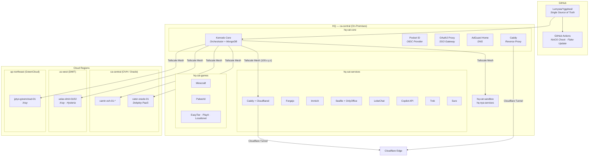

# 🌳 Yggdrasil


## Overview

Yggdrasil is a **declarative infrastructure monorepo** that manages the complete lifecycle of a multi-region, multi-host homelab and cloud environment. It solves three core problems:

1. **Configuration Drift** — Every host is defined as a reproducible NixOS flake. OS-level state is version-controlled, auditable, and rebuildable from scratch with a single command.
2. **Service Sprawl** — All Docker Compose stacks live alongside their host definitions in a single repository. [Komodo](https://komo.do) watches the repo, syncs changes, and rolls out updates automatically — eliminating manual `docker compose pull && up` sessions across a fleet.
3. **Secrets & Network Trust** — Tailscale provides an encrypted mesh between all nodes, Caddy terminates TLS with Cloudflare DNS challenges, and SOPS+age encrypts secrets at rest in the repo. No plaintext credentials ever touch Git.

### Use Cases

- Hosting self-managed services (Git forge, file sync, photo management, AI APIs, game servers) across on-premises and cloud nodes.
- Running a personal desktop workstation from the same Nix flake used for headless servers.
- Achieving GitOps-style continuous deployment for Docker stacks without Kubernetes overhead.

## Architecture / System Design



### Data Flow

1. A commit is pushed to `main`. GitHub Actions validates every NixOS host configuration with `nix flake check` and a dry-run build matrix.
2. Every 6 hours, Komodo's **"Run Sync and Deploy"** procedure pulls the latest commit, diffs all stack definitions, and deploys changed stacks to their target servers.
3. Each server runs a **Komodo Periphery** agent reachable only via its Tailscale address (`100.x.y.z:8120`). The core authenticates periphery connections using rotating Ed25519 key pairs.
4. Public-facing services are exposed through **Caddy** (automatic TLS via Cloudflare DNS-01) and optionally tunnelled through **Cloudflare Tunnels** for DDoS protection.

## Key Features

- **Fully Declarative OS Layer** — NixOS flakes with a modular feature-flag system (`features.*.enable`). Add Docker, Tailscale, or GNOME to any host by toggling a boolean.
- **GitOps for Docker Stacks** — Komodo syncs resource definitions from `komodo/resources/` and auto-deploys stacks tagged `auto-deploy`. No `kubectl`, no Helm — just Compose files and TOML.
- **Zero-Trust Networking** — All inter-node communication traverses a Tailscale WireGuard mesh. SSH is key-only. Docker daemon runs with `no-new-privileges`. Periphery endpoints require mutual TLS.
- **Secrets Never Leave the Repo Unencrypted** — SOPS with age encryption for NixOS secrets; Komodo variable interpolation (`[[VAR]]` syntax) for Docker stack secrets injected at deploy time.
- **Automated Maintenance Pipeline** — Daily Komodo procedures handle database backups, global container image updates, and server key rotation. Weekly GitHub Actions update the Nix flake lock and Docker Compose images via Dependabot.
- **Multi-Region, Multi-Provider Fleet** — Nodes span on-premises hardware, OVH, Oracle Cloud, DMIT, and GreenCloud across Canada, US, and Japan.
- **Desktop-as-Code** — The `kawaii` host proves the same flake can drive a full GNOME desktop with Nvidia drivers, Steam, Flatpak apps, Secure Boot (Lanzaboote), and CJK input methods.
- **Ntfy Alerting** — Server unreachable, CPU/memory/disk thresholds, container state changes, failed builds, and pending sync updates all push to an Ntfy topic.

## Tech Stack

| Layer | Technologies |
|---|---|
| **OS / IaC** | NixOS 25.11, Nix Flakes, Home Manager, Lanzaboote (Secure Boot) |
| **Secrets** | SOPS, age, sops-nix |
| **Containers** | Docker Engine, Docker Compose, Podman (optional) |
| **Orchestration** | Komodo (Core + Periphery), Watchtower |
| **Reverse Proxy** | Caddy (Docker Proxy mode), Cloudflare Tunnels |
| **Networking** | Tailscale (WireGuard mesh), EasyTier, Cloudflare |
| **DNS** | AdGuard Home |
| **Identity** | Pocket ID (OIDC), OAuth2 Proxy |
| **CI/CD** | GitHub Actions, Dependabot |
| **Alerting** | Ntfy |
| **Self-Hosted Services** | Forgejo, Immich, Seafile, OnlyOffice, LobeChat, Dokploy |
| **Game Servers** | Minecraft (itzg), Palworld |

## Prerequisites

| Requirement | Notes |
|---|---|
| **NixOS** | Hosts must be installed with NixOS. The flake targets `nixos-25.11` stable. |
| **Nix (with Flakes)** | `nix-command` and `flakes` experimental features must be enabled (handled by [`core.nix`](nixos/modules/features/core.nix:9)). |
| **Git** | The rebuild script validates it is running inside a Git work tree. |
| **SOPS + age** | An age key must be placed at `/var/lib/sops-nix/key.txt` on each host that decrypts secrets. |
| **Tailscale Account** | Each node must be authenticated to your Tailnet with `tailscale up --authkey`. |
| **Komodo Core** | One node (typically `hq-cat-core`) runs the Komodo Core stack with MongoDB. |
| **Cloudflare Account** | Required for DNS-01 TLS challenges and optional tunnel ingress. |
| **Docker** | Installed declaratively via [`docker.nix`](nixos/modules/features/virtualisation/docker.nix:1) on server hosts. |

## Getting Started / Deployment

### 1. Clone the Repository

```
git clone https://github.com/Lumysia/Yggdrasil.git
cd Yggdrasil
```

### 2. Provision the Age Key

Place the host's age private key so sops-nix can decrypt secrets at build time:

```
sudo mkdir -p /var/lib/sops-nix
sudo cp /path/to/age-key.txt /var/lib/sops-nix/key.txt
sudo chmod 600 /var/lib/sops-nix/key.txt
```

### 3. Build and Activate a Host

For a first-time installation onto a freshly partitioned drive:

```
./nixos-rebuild.sh -I hq-cat-services
```

For subsequent rebuilds on an already-running host:

```
./nixos-rebuild.sh hq-cat-services
```

To update flake inputs and pull latest changes before rebuilding:

```
./nixos-rebuild.sh -u hq-cat-services
```

To build for next-boot instead of live-switching:

```
./nixos-rebuild.sh -b hq-cat-services
```

If the host requires a network proxy:

```
./nixos-rebuild.sh -p http://proxy:8080 hq-cat-services
```

### 4. Join the Tailnet

After the first boot, authenticate the node:

```
sudo tailscale up --authkey tskey-auth-XXXXX
```

### 5. Deploy Komodo Core

On the designated core node, populate the `.env` file and start the stack:

```
cd /data/infra/komodo/core
docker compose up -d
```

### 6. Deploy Periphery Agents

On every other managed node, start the periphery agent:

```
cd /data/infra/komodo/periphery
docker compose up -d
```

For non-NixOS nodes that need Tailscale in a container, use the `periphery-tailscale` variant:

```
cd /data/infra/komodo/periphery-tailscale
TAILSCALE_AUTH_KEY=tskey-auth-XXXXX docker compose up -d
```

### 7. Trigger Initial Sync

In the Komodo UI, run the **"Sync-Yggdrasil"** resource sync. This imports all server, stack, alerter, procedure, and action definitions from [`komodo/resources/`](komodo/resources/).

### 8. Set Komodo Variables

In the Komodo UI, populate all `[[VARIABLE]]` references used in stack environment blocks (e.g., `COMMON_DOMAIN_A`, `COMMON_CF_API_TOKEN`, database passwords). These are injected at deploy time and never stored in the repository.

## Usage

### Viewing Logs

```
docker compose -f apps/hq-cat-services/networking/compose.yaml logs -f caddy
```

### Verifying Komodo Sync Status

Open the Komodo Core dashboard at `https://{CORE_HOST}:9120`. The **Syncs** page shows whether `Sync-Yggdrasil` has pending changes. The **Procedures** page shows execution history for automated routines.

### Rebuilding NixOS After a Config Change

```
git add -A && git commit -m "feat(nixos): update hq-cat-services"
git push
./nixos-rebuild.sh hq-cat-services
```

The GitHub Actions pipeline will also validate the change across all hosts automatically.

## License

This project is licensed under the [GNU Affero General Public License v3.0](LICENSE).
